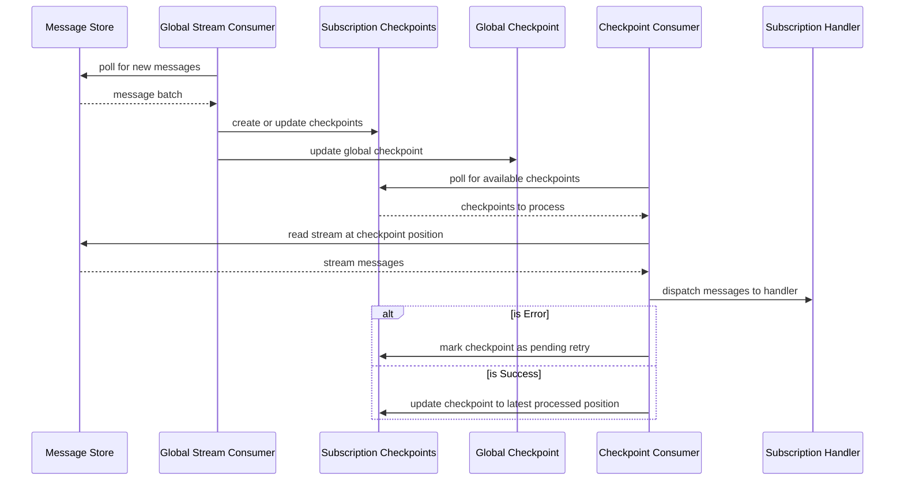

# Beckett

Event sourcing is a powerful pattern for building applications but reading and writing events using an event store is only half of the equation. Beckett aims to fill in the gaps:

- Subscriptions - subscribe to messages and process them in order by stream
  - Horizontal scalability - use auto-scaling to have as many workers as needed processing messages in parallel where the work is distributed automatically across all available nodes without needing to manage the distribution by way of consumer groups or similar mechanisms
  - Retries - built-in retry support for failed messages - since messages are processed in order by stream per subscription, a failed message only blocks a single stream for a subscription at a time and the rest of the streams can continue processing for that subscription
- Scheduled / recurring messages - schedule messages to be sent at a future time with cancellation support, or create a recurring schedule to send messages at a regular interval using cron expressions for scheduled jobs, etc...
- Open Telemetry - built-in support to provide tracing and metrics
- Dashboard - browse messages, retry failed subscription checkpoints
- Bring Your Own Event Store - Beckett provides a simple Postgres-based message store or use your own by implementing the `IMessageStorage` interface

## Example
We are building a warehouse management system and we need to allocate inventory to orders. The requirements are that allocation occurs when an item is added to an order:
```csharp
using Beckett;
using Beckett.Database;

var builder = Host.CreateApplicationBuilder(args);

var connectionString = builder.Configuration.GetConnectionString("InventoryAllocation")!;

await PostgresMigrator.UpgradeSchema(connectionString);

builder.Services.AddNpgsqlDataSource(connectionString, options => options.AddBeckett());

builder.Services.AddTransient<OrderItemAddedHandler>();

var beckett = builder.AddBeckett(
    options => { options.WithSubscriptionGroup("InventoryAllocation"); }
);

beckett.AddSubscription("order-item-inventory-allocation")
    .Message<OrderItemAdded>()
    .Handler<OrderItemAddedHandler>((handler, message, token) => handler.Handle(message, token));

var host = builder.Build();

host.Run();

public record OrderItemAdded(Guid OrderId, Guid ProductId, int Quantity);

public record InventoryAllocated(Guid ProductId, Guid OrderId, int Quantity);

public class OrderItemAddedHandler(IMessageStore messageStore)
{
    public async Task Handle(OrderItemAdded message, CancellationToken cancellationToken)
    {
        await messageStore.AppendToStream(
            $"Inventory-{message.ProductId}",
            ExpectedVersion.Any,
            new InventoryAllocated(message.ProductId, message.OrderId, message.Quantity),
            cancellationToken
        );
    }
}
```
In this example application we are handling the `OrderItemAdded` event with the `OrderItemAddedHandler` class. The host has been configured to use the `InventoryAllocation` subscription group, and there can be as many instances of this host running as necessary and the work will be divided among them
automatically allowing you to take advantage of auto scaling without limits. The handler will receive all `OrderItemAdded` messages written to the message store since it is subscribed to that type in the `AddSubscription` call. When a message is received it is dispatched to the handler which then writes an `InventoryAllocated` event to an `Inventory` stream to track allocated product inventory.

One of the guiding design principles of Beckett is keeping a minimal footprint - there should be as few references to Beckett-provided types in application code as possible. Subscription handlers are registered as inline delegates that can refer to handler instances that are resolved from the container or static functions. The only type from Beckett used in the application code in this sample is `IMessageStore` which itself is optional if you're using your own message store.

The call to `PostgresMigrator.UpgradeSchema` in the example is applying any outstanding migrations to the database that are required by Beckett. If you wish to run the migrations separately using Flyway or similar tools then you can use the `dump-migrations` shell script supplied in the root of the directory to create a single SQL file:

```shell
./dump-migrations.sh beckett 001.sql
```

In this case `beckett` is the schema you'd like to use in your database for the tables, functions, and types that
Beckett uses and `001.sql` is the path of the file you'd like to create.

### How It Works


* Subscriptions subscribe to stream categories and/or message types
* Subscriptions belong to subscription groups - `InventoryAllocation`
* Each host is assigned to a subscription group - `options.WithSubscriptionGroup("InventoryAllocation")`
* Global checkpoints keep track of what messages Beckett has read from the message store per subscription group
* The global stream consumer reads new messages from the message store based on the global checkpoint
* Using the subscription configuration registered in the host it determines what checkpoints to create or update in terms of work to be done per subscription
* Checkpoints are per group + subscription + stream
* Checkpoints track the stream version - the current version of the stream being tracked - as well as the stream position, which is the position in the stream that Beckett has processed up to
* If the stream version of a checkpoint is greater than the stream position it is considered to be "lagging"
* The checkpoint consumer watches for lagging checkpoints - once it sees one it attempts to reserve it so it can be processed
* Checkpoint reservations last a configurable amount of time (default 5 minutes) and if they are not processed before then (process killed, etc...) then the reservations can expire at which point they can be recovered and processed again
* Checkpoint expired reservation recovery runs every minute by default
* Checkpoints are processed by handling the messages in stream order, dispatching them to the handler for the subscription one at a time
* Checkpoints are processed in parallel, with the allowed concurrency configured via `options.Subscriptions.Concurrency` (defaults to the number of CPUs in the host * 5 or 20, whichever number is smaller)
* If a subscription handler encounters an error processing a message the checkpoint will be retried in a separate process up to a max number of retries using exponential backoff, at which point it changes to the failed status
* Once a checkpoint is failed it can be manually retried at any point in time
* If a retry succeeds at any point the checkpoint becomes active again and can process new messages
* Deleting checkpoints means that checkpoint **will not be processed again** - it is a means by which you can clear failed checkpoints from the dashboard that you do not care about any more

## Dashboard
Beckett comes batteries-included with a dashboard to provide visibility into your system while it's running, retry failed checkpoints, and so on:


Adding the Beckett dashboard to an ASP.NET Core application is simple:

```csharp
var builder = WebApplication.CreateBuilder(args);

var app = builder.Build();

app.MapBeckettDashboard("/beckett");

app.Run();
```

In this example, the dashboard will be available at `http://localhost:<port>/beckett` and can be further configured using standard ASP.NET Core route group configuration options - authorization, etc...
