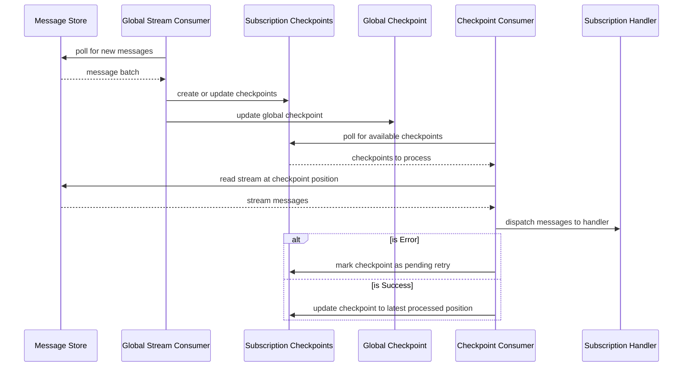

# Subscriptions

## How It Works

* Subscriptions subscribe to stream categories and/or message types
* Subscriptions belong to subscription groups - `InventoryAllocation`
* Each host is assigned to a subscription group - `options.WithSubscriptionGroup("InventoryAllocation")`
* Global checkpoints keep track of what messages Beckett has read from the message store per subscription group
* The global stream consumer reads new messages from the message store based on the global checkpoint
* Using the subscription configuration registered in the host it determines what checkpoints to create or update in
  terms of work to be done per subscription
* Checkpoints are per group + subscription + stream
* Checkpoints track the stream version - the current version of the stream being tracked - as well as the stream
  position, which is the position in the stream that Beckett has processed up to
* If the stream version of a checkpoint is greater than the stream position it is considered to be "lagging"
* The checkpoint consumer watches for lagging checkpoints - once it sees one it attempts to reserve it so it can be
  processed
* Checkpoint reservations last a configurable amount of time (default 5 minutes) and if they are not processed before
  then (process killed, etc...) then the reservations can expire at which point they can be recovered and processed again
* Checkpoint expired reservation recovery runs every minute by default
* Checkpoints are processed by handling the messages in stream order, dispatching them to the handler for the
  subscription one at a time
* Checkpoints are processed in parallel, with the allowed concurrency configured via `options.Subscriptions.Concurrency`
  (defaults to the number of CPUs in the host * 5 or 20, whichever number is smaller)
* If a subscription handler encounters an error processing a message the checkpoint will be retried in a separate
  process up to a max number of retries using exponential backoff, at which point it changes to the failed status
* Once a checkpoint is failed it can be manually retried at any point in time
* If a retry succeeds at any point the checkpoint becomes active again and can process new messages
